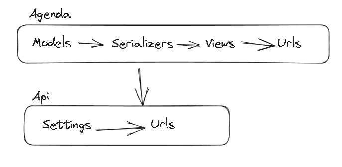

Primeiro passo é criar o ambiente de desenvolvimento: `python3 -m venv venv` e ativá-lo para instalar dependêncies e rodar o projeto: `source ./venv/bin/activate`.
Para instalação individual de dependências pode ser feito por: `pip install Django==4.2.4` ou para instalar a partir de um gerenciador por: `pip install -r requirements/dev.txt`

Com a instalação do Django é realizado a criação do projeto: `django-admin startproject <project-name> .`, para testar seu êxito rode o servidor: `python manage.py runserver`.
A criação de aplicação se dá a nível de entidades logo para cada aplicação deverá ser criada por: `django-admin startapp <app-name>`.

Assim é possível com a aplicação criada gerar seus `Models`, como exemplo:
```
from django.db import models


class Agendamento(models.Model):
  data_agendamento = models.DateTimeField()
  nome_cliente = models.CharField(max_length=255)
  email_cliente = models.EmailField()
  telefone_cliente = models.CharField(max_length=20)
  cancelado = models.BooleanField(default=False)
```

Após a criação do models é nencessário gerar suas migrations: `python manage.py makemigrations` e `python manage.py migrate`



As configurações do projeto é importante ser separada pelo escopo do ambiente em questão. Assim em `/api/settings` gere um `__init__.py` para modularizar o dir, e dentro especifique suas configurações `base`, `dev` e `prod`. Após as configurações definidas devem ser passadas para os arquivos de carregamento em: `/api/asgi.py`, `/api/wsgi.py` e `/manage.py`
